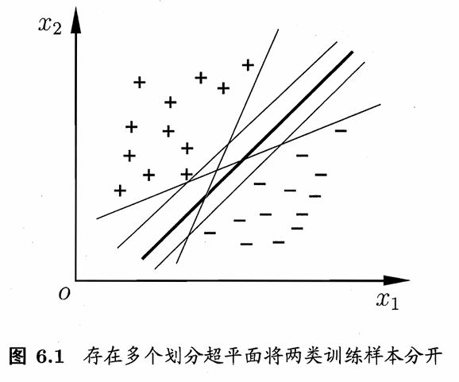
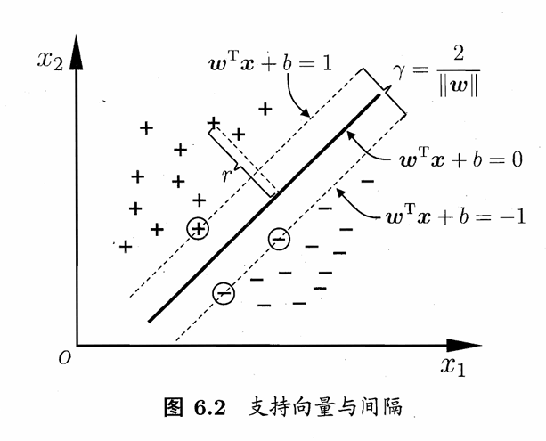
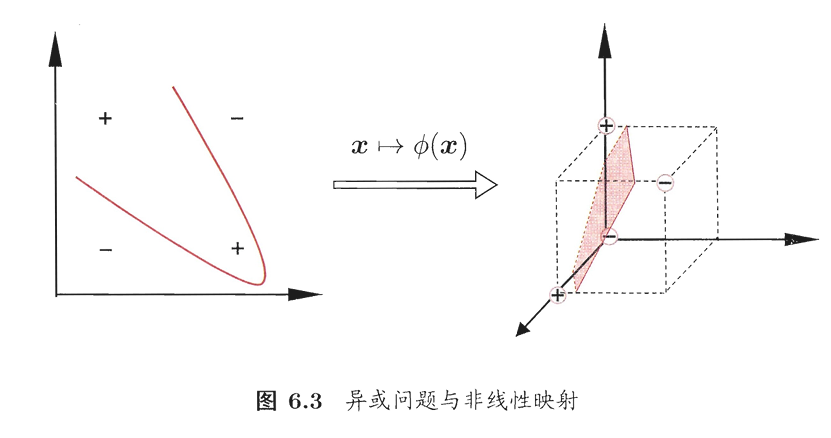

# 间隔与支持向量
对于分类问题，其训练样本为 $D=\{(\bm{x}_1,y_1),(\bm{x}_2,y_2),\cdots(\bm{x}_n,y_n)\},\ y_i\in\{-1,1\}$ , 将其放在坐标系中，我们希望能够找到某个超平面，能够将这些正例和反例分隔开。

在样本空间中，划分超平面用下面的线性方程来描述：
$$\bm{w}^T\bm{x}+b=0$$
其中 $\bm{w}$ 是法向量， $b$ 是位移项，对任意样本空间中的点 $\bm{x}$ ，其到超平面 $(\bm{w},b)$ 的距离为
$$r_{\bm{x}}=\dfrac{|\bm{w}^T\bm{x}+b|}{\|\bm{w}\|}$$
假定我们已经找到了划分超平面能够将训练样本正确分类，由于线性方程中 $(\bm{w},b)$ 可以等比例调整大小，因此我们令：
$$\left\{\begin{array}{ll}
    \bm{w}^T\bm{x}_i+b\geqslant 1, & y_i=1\\
    \bm{w}^T\bm{x}_i+b\leqslant -1,& y_i=-1
\end{array}\right.$$
此时我们找到距离超平面最近的几个样本，也就如下图所示，他们被称为支持向量，此时两个异类支持向量到超平面的距离之和为
$$\gamma=\dfrac{2}{\|\bm{w}\|}$$
他被称为间隔。

从图中我们不难看出，为了让模型的泛化能力尽可能强，我们就希望间隔尽可能大，也就是实现下面的数学模型：
$$\begin{array}{ll}
    \max\limits_{\bm{w},b} & \dfrac{2}{\|\bm{w}\|}\\[12pt]
    s.t. & y_i(\bm{w}^T\bm{x}_i+b)\geqslant 1,\ i=1,2,\cdots,m
\end{array}$$
或者我们将其写作：
$$\begin{array}{ll}
    \min\limits_{\bm{w},b} & \dfrac{\|\bm{w}\|^2}{2}\\[12pt]
    s.t. & y_i(\bm{w}^T\bm{x}_i+b)\geqslant 1,\ i=1,2,\cdots,m
\end{array}$$

# 对偶问题
这里本质上就是利用[拉格朗日乘子法](Method_of_Lagrange_Multipliers.md)和 KKT 方法。针对上面的规划问题，我们应用拉格朗日乘子法，计算过程可以参考教材，最终得到下面的二次规划问题：
$$\begin{align*}
    \max\limits_{\bm{\alpha}} & \sum\limits_{i=1}^m \alpha_i-\dfrac{1}{2}\sum\limits_{i=1}^m\sum\limits_{j=1}^m\alpha_i\alpha_j y_i y_j\bm{x}_i^T\bm{x}_j\\
    s.t. & \sum\limits_{i=1}^m\alpha_iy_i=0\\
    & \alpha_i\geqslant 0,\ i=1,2,\cdots,m
\end{align*}$$
他的 KKT 条件为
$$\left\{\begin{array}{l}
    \alpha_i\geqslant 0\\[6pt]
    y_if(\bm{x}_i)-1\geqslant 0\\[6pt]
    \alpha_i(y_if(\bm{x}_i)-1)=0
\end{array}\right.$$
这个问题可能由于训练样本较大，时间和空间成本较大，因此我们在这里介绍一个 SMO 算法。

SMO 算法本质上就是一个跷跷板游戏，如果我确定两个参数 $\alpha_i,\alpha_j$ ，其他的参数保持不变，此时如果我改变 $\alpha_i$ ，结合
$$\alpha_k y_k=-\sum\limits_{i\neq k}\alpha_i y_i=C$$
我们知道 $\alpha_j$ 将会随着 $\alpha_i$ 的变化而变化，因此他的执行步骤是这样的:
1) 初始化 $\bm{\alpha}$ 后计算 $$u_i=\bm{w}^T\bm{x}_i+b=\sum\limits_{j=1}^m\alpha_jy_j(\bm{x}_j^T\bm{x}_i)+b$$
并得到每个样本的误差 $E_i=|y_i-u_i|$ , 找到误差最大的两个方向，确定变动的参数 $\alpha_i, \alpha_j$ .
2) 固定其他参数，并计算 $C=\alpha_iy_i+\alpha_j y_j$ ，并以此用 $\alpha_i$ 表示 $\alpha_j$ ，将问题转化为一元二次函数求极值问题。
3) 对 $\alpha_i,\alpha_j$ 的范围，如果超出范围直接取到范围的上/下界。
4) 不断更新迭代，直至所有 $\alpha_i$ 满足 KKT 条件。

那么最后的问题就是如何确定偏移项 $b$ 。结合所有支持向量 $(\bm{x}_s,y_s)$ 都满足 $y_sf(\bm{x}_s)=1$ ，也就是
$$y_s\bigg(\sum\limits_{i\in S}\alpha_iy_i\bm{x}_i^T\bm{x}_s+b\bigg)=1$$
其中 $S=\{i|\alpha_i>0,i=1,2,\cdots,m\}$ ，通过求解它获得 $b$ ，但是现实任务中我们一般采用这样的方法：
$$b=\dfrac{1}{|S|}\sum\limits_{s\in S}\bigg(y_s-\sum\limits_{i\in S}\alpha_iy_i\bm{x}_i^T\bm{x}_s\bigg)$$

# 核函数
在上面的讨论中，我们主要将问题建立在可以找到划分超平面的基础之上，但是在大多数情况下，我们一般不能找到这样的超平面，它太理想化了，因此我们希望将原数据映射到一个更更高维的特征空间，使得数据在这个特征空间中实现线性可分，如下图所示。

取 $\phi(\bm{x})$ 是映射后的特征向量，原规划问题也就变成了：
$$\begin{array}{ll}
    \min\limits_{\bm{w},b} & \dfrac{\|\bm{w}\|^2}{2}\\[12pt]
    s.t. & y_i(\bm{w}^T\phi(\bm{x})_i+b)\geqslant 1,\ i=1,2,\cdots,m
\end{array}$$
对偶问题为
$$\begin{align*}
    \max\limits_{\bm{\alpha}} & \sum\limits_{i=1}^m \alpha_i-\dfrac{1}{2}\sum\limits_{i=1}^m\sum\limits_{j=1}^m\alpha_i\alpha_j y_i y_j\phi(\bm{x}_i)^T\phi(\bm{x}_j)\\
    s.t. & \sum\limits_{i=1}^m\alpha_iy_i=0\\
    & \alpha_i\geqslant 0,\ i=1,2,\cdots,m
\end{align*}$$
为了计算 $\phi(\bm{x}_i)^T\phi(\bm{x}_j)$ 我们引入函数
$$\kappa(\bm{x}_i,\bm{x}_j)=\langle\phi(\bm{x}_i),\phi(\bm{x}_j)\rangle=\phi(\bm{x}_i)^T\phi(\bm{x}_j)$$
此时上面的式子也就变成了
$$\begin{align*}
    \max\limits_{\bm{\alpha}} & \sum\limits_{i=1}^m \alpha_i-\dfrac{1}{2}\sum\limits_{i=1}^m\sum\limits_{j=1}^m\alpha_i\alpha_j y_i y_j\kappa(\bm{x}_i,\bm{x}_j)\\
    s.t. & \sum\limits_{i=1}^m\alpha_iy_i=0\\
    & \alpha_i\geqslant 0,\ i=1,2,\cdots,m
\end{align*}$$
此时我们有
$$f(\bm{x})=\bm{w}^T\phi(\bm{x})+b=\sum\limits_{i=1}^m\alpha_iy_i\kappa(\bm{x},\bm{x}_i)+b$$
在现实中，我们可能不知道什么样的函数适合做核函数，这里我们有一个这样的定理：
>定理：令 $\mathcal{X}$ 为输入空间， $\kappa(\cdot,\cdot)$ 是定义在 $\mathcal{X}\times\mathcal{X}$ 上的对称函数，则 $\kappa$ 是核函数当且仅当对于任意数据 $D=\{\bm{x}_1,\bm{x}_2,\cdots,\bm{x}_m\}$ ，核矩阵 $\bm{K}$ 是半正定的：
$$K=\begin{bmatrix}
    \kappa(\bm{x}_1,\bm{x}_1) & \cdots & \kappa(\bm{x}_1,\bm{x}_j) & \cdots & \kappa(\bm{x}_1,\bm{x}_m)\\
    \vdots & \ddots & \vdots & \ddots & \vdots\\
    \kappa(\bm{x}_i,\bm{x}_1) & \cdots & \kappa(\bm{x}_i,\bm{x}_j) & \cdots & \kappa(\bm{x}_i,\bm{x}_m)\\
    \vdots & \ddots & \vdots & \ddots & \vdots\\
    \kappa(\bm{x}_m,\bm{x}_1) & \cdots & \kappa(\bm{x}_m,\bm{x}_j) & \cdots & \kappa(\bm{x}_m,\bm{x}_m)
\end{bmatrix}$$

事实上，对于一个半正定核矩阵，总能找到一个与之对应的映射 $\phi$ ，也就是说，任何一个核函数都隐式地定义了一个称为 **再生核希尔伯特空间** (Reproducing Kernel Hilbert Space, RKHS) 地特征空间。

总的来说核函数选择是支持向量机地最大变数，我们在这里列举几种常见的核函数：
| 名称 | 表达式 | 参数 |
| :--- | :--- | :--- |
| 线性核 | $\kappa(\boldsymbol{x}_i, \boldsymbol{x}_j) = \boldsymbol{x}_i^{\mathrm{T}}\boldsymbol{x}_j$ | |
| 多项式核 | $\kappa(\boldsymbol{x}_i, \boldsymbol{x}_j) = (\boldsymbol{x}_i^{\mathrm{T}}\boldsymbol{x}_j)^d$ | $d \geqslant 1$ 为多项式的次数 |
| 高斯核 | $\kappa(\boldsymbol{x}_i, \boldsymbol{x}_j) = \exp \left( -\frac{\|\boldsymbol{x}_i - \boldsymbol{x}_j\|^2}{2\sigma^2} \right)$ | $\sigma > 0$ 为高斯核的带宽(width) |
| 拉普拉斯核 | $\kappa(\boldsymbol{x}_i, \boldsymbol{x}_j) = \exp \left( -\frac{\|\boldsymbol{x}_i - \boldsymbol{x}_j\|}{\sigma} \right)$ | $\sigma > 0$ |
| Sigmoid 核 | $\kappa(\boldsymbol{x}_i, \boldsymbol{x}_j) = \tanh(\beta \boldsymbol{x}_i^{\mathrm{T}}\boldsymbol{x}_j + \theta)$ | $\tanh$ 为双曲正切函数, $\beta > 0, \theta < 0$ |

此外，还可通过函数组合得到，例如：

*   若 $\kappa_1$ 和 $\kappa_2$ 为核函数，则对于任意正数 $\gamma_1$、$\gamma_2$，其线性组合

    $$
    \gamma_1 \kappa_1 + \gamma_2 \kappa_2
    $$

    也是核函数；

*   若 $\kappa_1$ 和 $\kappa_2$ 为核函数，则核函数的直积

    $$
    \kappa_1 \otimes \kappa_2(\boldsymbol{x}, \boldsymbol{z}) = \kappa_1(\boldsymbol{x}, \boldsymbol{z})\kappa_2(\boldsymbol{x}, \boldsymbol{z})
    $$

    也是核函数；

*   若 $\kappa_1$ 为核函数，则对于任意函数 $g(\boldsymbol{x})$，

    $$
    \kappa(\boldsymbol{x}, \boldsymbol{z}) = g(\boldsymbol{x})\kappa_1(\boldsymbol{x}, \boldsymbol{z})g(\boldsymbol{z})
    $$

    也是核函数。

# 软间隔与正则化
在现实任务中，我们往往很难确定合适的核函数使得训练样本在特征空间中线性可分，而且训练出的模型可能是过拟合的，在这样的条件下，我们可以允许一部分样本出错，也就引入了软间隔的概念。
软间隔我们可以通过罚函数的形式呈现，我们将目标函数写作：
$$\min\limits_{\bm{w},b}\dfrac{1}{2}\|\bm{w}\|^2+C\sum\limits_{i=1}^m\ell_{0/1}(y_i(\bm{w}^T\bm{x}_i+b)-1)$$
其中 $C>0$ 是一个常数， $\ell_{0/1}$ 是 0/1 损失函数，显然当 $C\to\infty$ 时，所有约束均满足条件，当然由于 $\ell_{0/1}$ 的函数性质并不是很好，我们另外介绍三种常用的损失函数：
$$hinge \text{损失}: \ell_{hinge}(z)=\max(0,1-z)$$
$$\text{指数损失}: \ell_{exp}(z)=\exp(-z)$$
$$\text{对率损失}: \ell_{log}(z)=\log(1+\exp(-z))$$
例如我们选择 hinge 损失，则损失函数写作
$$\min\limits_{\bm{w},b}\dfrac12\|\bm{w}\|^2+C\sum\limits_{i=1}^m\max(0,1-y_i(\bm{w}^T\bm{x}_i+b))$$
这里我们使用运筹学的思想，引入松弛变量，上面的问题我们就转化为
$$\begin{array}{ll}
    \min\limits_{\bm{w},b,\xi_i} & \dfrac12\|\bm{w}\|^2+C\sum\limits_{i=1}^m\xi_i\\[8pt]
    s.t.& y_i(\bm{w}^T\bm{x}_i+b)\geqslant 1-\xi_i\\[8pt]
    &\xi_i\geqslant 0,i=1,2,\cdots,m
\end{array}$$
这个问题说到底又回到了拉格朗日乘子法的结构，我们再次引入拉格朗日乘子 $\alpha_i, \mu_i\geqslant 0$ , 则对应问题变成了
$$\begin{array}{ll}
    \max\limits_{\bm{\alpha}}&\sum\limits_{i=1}^m\alpha_i-\dfrac12\sum\limits_{i=1}^m\sum\limits_{j=1}^m\alpha_i\alpha_j y_iy_j\bm{x}_i^T\bm{x}_j^T\\[8pt]
    s.t.& \sum\limits_{i=1}^m\alpha_iy_i=0\\[8pt]
    &0\leqslant \alpha_i\leqslant C,\ i=1,2,\cdots,m
\end{array}$$

# 支持向量回归
支持向量的思想可以用来解决回归问题。针对训练样本 $D=\{(\bm{x}_1,y_1),(\bm{x}_2,y_2),\cdots,(\bm{x}_m,y_m)\},\ y_i\in \mathbb{R}$ ，支持向量回归 (Support Vector Regression, SVM) 假设我们能容忍 $f(\bm{x})$ 与 $y$ 之间有 $\varepsilon$ 的误差，也就是构建了一个宽度为 $2\varepsilon$ 尖阁待，则此时问题转化为
$$\min\limits_{\bm{w},b}\dfrac12\|\bm{w}\|^2+C\sum\limits_{i=1}^m\ell_{\varepsilon}(f(\bm{x}_i)-y_i)$$
其中
$$\ell_{\varepsilon}(z)=\left\{\begin{array}{ll}
    0, & if\ |z|\leqslant \varepsilon\\
    |z|-\varepsilon ,& otherwise
\end{array}\right.$$
同样的，我们引入松弛变量
$$\begin{array}{ll}
    \min\limits_{\bm{w},b,\xi_i,\hat{\xi}_i} & \dfrac12\|\bm{w}\|^2+C\sum\limits_{i=1}^m(\xi_i+\hat{\xi}_i)\\[8pt]
    s.t.& f(\bm{x}_i)-y_i\leqslant \varepsilon+\xi_i\\[8pt]
    & y_i-f(\bm{x}_i)\leqslant \varepsilon+\hat{\xi}_i\\[8pt]
    &\xi_i,\hat{\xi}_i\geqslant 0,i=1,2,\cdots,m
\end{array}$$
利用拉格朗日乘子法，我们得到对偶问题：
$$\begin{array}{ll}
    \max\limits_{\bm{\alpha},\hat{\bm{\alpha}}} &\sum\limits_{i=1}^m y_i(\hat{\alpha}_i-\alpha_i)-\varepsilon(\hat{\alpha}_i+\alpha_i)-\dfrac12\sum\limits_{i=1}^m\sum\limits_{j=1}^m(\hat{\alpha}_i-\alpha_i)(\hat{\alpha}_j-\alpha_j)\bm{x}_i^T\bm{x}_j\\[8pt]
    s.t.& \sum\limits_{i=1}^m(\hat{\alpha}_i-\alpha_i)=0\\
    & 0\leqslant \alpha_i,\hat{\alpha}_i\leqslant C
\end{array}$$
另外 $\bm{w}$ 满足 $\bm{w}=\sum\limits_{i=1}^m(\hat{\alpha}_i-\alpha_i)\bm{x}_i$ , 且该过程满足 KKT 条件时：
$$\left\{\begin{array}{l}
    \alpha_i(f(\bm{x}_i)-y_i-\varepsilon-\xi_i)=0\\[8pt]
    \hat{\alpha}_i(y_i-f(\bm{x}_i)-\varepsilon-\hat{\xi}_i)=0\\[8pt]
    \alpha_i\hat{\alpha}_i=0,\ \xi_i\hat{\xi}_i=0\\[8pt]
    (C-\alpha_i)\xi_i=0,\ (C-\hat{\alpha}_i)\hat{\xi}_i=0
\end{array}\right.$$
我们将 $\bm{w}$ 带入超平面方程，有
$$f(\bm{x})=\sum\limits_{i=1}^m(\hat{\alpha}_i=\alpha_i)\bm{x}_i^T\bm{x}+b$$
另外，结合 $(C-\alpha_i)\xi_i=0$ 且 $\alpha_i(f(\bm{x}_i)-y_i-\varepsilon-\xi_i)=0$ ，于是若 $0<\alpha_i<C$ ,就一定有 $\xi_i=0$ ，因此
$$b=y_i+\varepsilon-\sum\limits_{i=1}^m(\hat{\alpha}_i-\alpha_i)\bm{x}_i^T\bm{x}$$
当然像上面取平均值的方法也是可行的。

# 核方法
本节我们首先介绍表示定理：
>令 $\mathbb{H}$ 为核函数 $\kappa$ 对应的再生核希尔伯特空间, $\|h\|_{\mathbb{H}}$ 表示 $\mathbb{H}$ 空间中关于 $h$ 的范数，对于任意单调递增函数 $\Omega:[0,\infty]\mapsto\mathbb{R}$ 和任意非负损失函数 $\ell:\mathbb{R}^m\mapsto[0,\infty]$ ，优化问题
$$\min\limits_{h\in\mathbb{H}}F(h)=\Omega(\|h\|_{\mathbb{H}})+\ell(h(\bm{x}_1),h(\bm{x}_2),\cdots,h(\bm{x}_m))$$
的解总可写作：
$$h^*(\bm{x})=\sum\limits_{i=1}^m\alpha_i\kappa(\bm{x},\bm{x}_i)$$

一切基于核函数的学习方法我们都称为核方法，比较常见的就是通过引入核函数 (核化) 来讲线性学习器拓展为非线性学习器，我们将这种方法称为 **核线性判别分析** (Kernelized Linear Discriminant Analysis, KLDA) .
